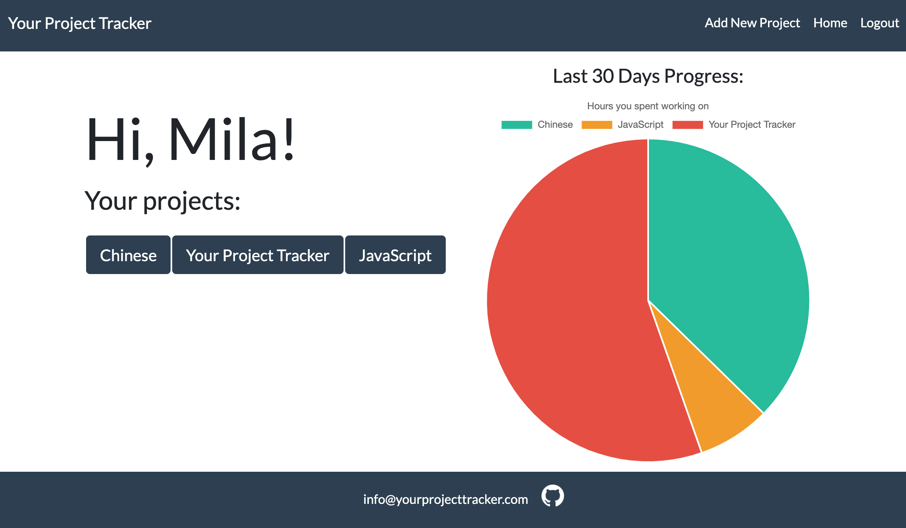
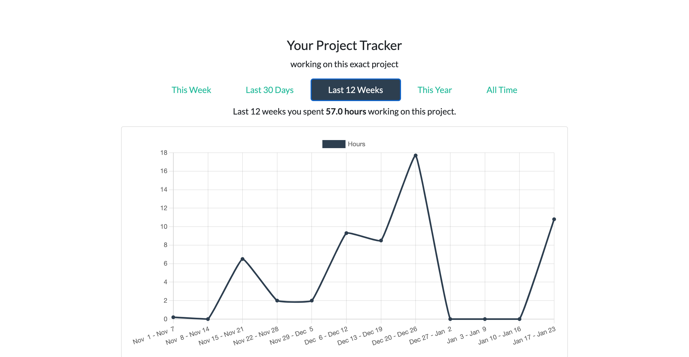
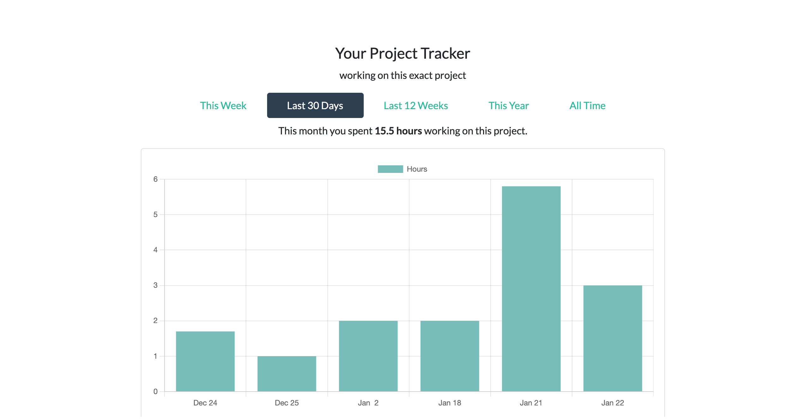
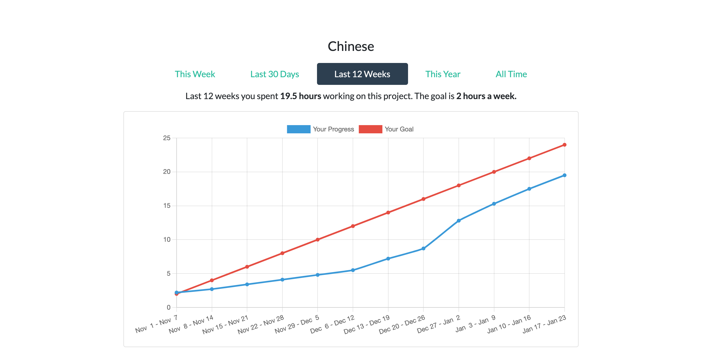

# [**Your Project Tracker**](https://yourprojecttracker.com/)

A minimalistic web-app to measure time you spend on your projects and track your progress with useful infographics.

Built with Flask, SQLite, Bootstrap 5 and Chart.js.
## [](https://github.com/marketplace/actions/super-linter)



## Features

- Create an account
- Add projects to track
- Use a timer/stopwatch here online
- Or add minutes to a project manually
- Get "Last 30 Days Progress" pie chart with all your recent projects
- Watch your progress throughout a week, a month or a year
- Set a weekly goal and get a scoreboard-like "Last 12 weeks" chart

## Screenshots





## Run Locally

(Docker and Docker-Compose required)

1. Clone the project

```bash
  git clone https://github.com/LiudmilaLV/Your_Project_Tracker.git
```

2. Go to the project directory

```bash
  cd Your_Project_Tracker
```

3. Build the image

```bash
  docker-compose -f docker-compose.local.yml build
```

4. Run the container

```bash
  docker-compose -f docker-compose.local.yml up
```

